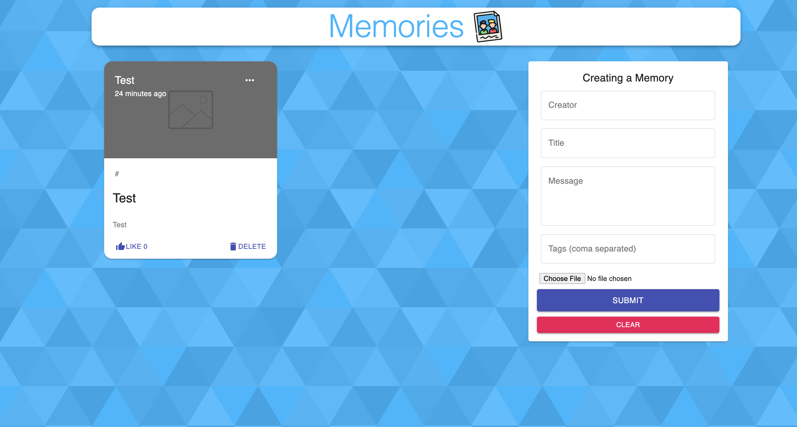
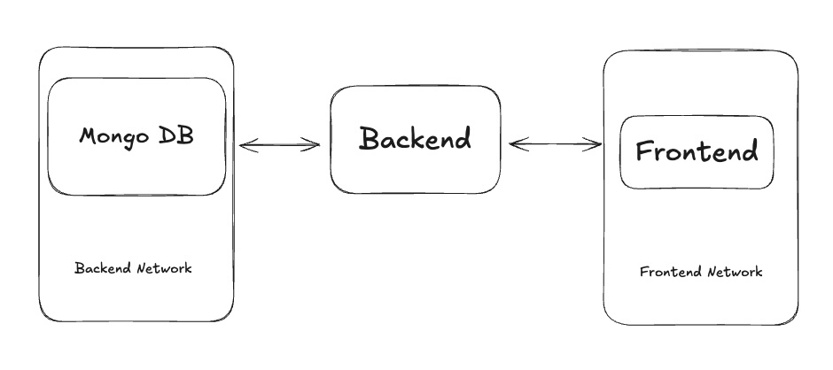

# Assignment Requirement

- This assignment requires you to containerize the backend and frontend applications in this repository and create a docker-compose script for easy deployments.

The application uses the following technologies:

- Frontend: React
- Backend: Node.js
- Database: MongoDB

The frontend and backend applications are already built and working. You need to containerize them using Docker.

## Frontend Application build process

1. Navigate to the `client` directory.
2. Run `yarn install` to install the dependencies.
3. Rename `.env.example` to `.env`
4. Run `yarn build` to build the application.
5. The build files will be generated in the `client/build` directory.

The frontend application runs on PORT `3000`.

## Backend Application build process

1. Navigate to the `server` directory.
2. Run `npm install` to install the dependencies.
3. Rename `.env.example` to `.env`
4. Run `node server.js` to start the server.

The backend application runs on PORT `4000`.

## Instructions to dockerize the applications

1. Use appropriate base images for the all applications.
2. Follow all the best practices for writing Dockerfiles.
3. Use multi-stage builds if necessary.
4. Don't store any senstive information such as passwords, usernames, and urls in both the Dockerfile and docker-compose.yaml files. Use a `.env` file instead.
5. Use a `.dockerignore` file to ignore unnecessary files and directories to reduce image sizes.
6. Application should be accessible on the following ports:
    - Frontend: PORT `80`
    - Backend: PORT `4000`
7. You can refer any article / documentation on the internet on how to containerize the application

# Network Diagram

